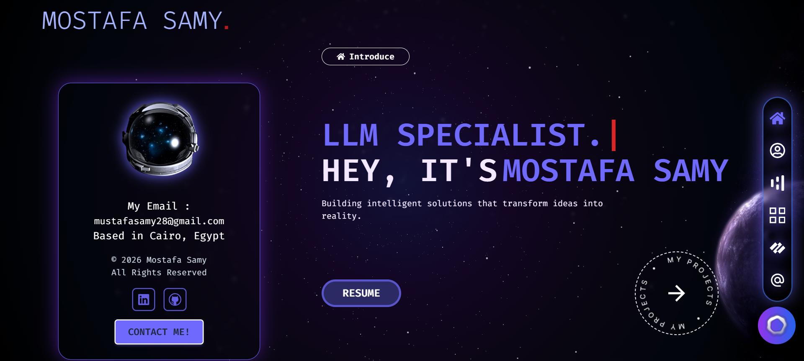

# AI Portfolio - Mostafa Samy

A modern, responsive portfolio website showcasing AI engineering projects, skills, and professional experience. Features an intelligent hybrid chatbot powered by rule-based keyword matching and OpenAI GPT-4o-mini.



## 🌟 Features

### Core Portfolio Features
- **Responsive Design**: Optimized for desktop, tablet, and mobile devices
- **Smooth Animations**: Beautiful animations using Framer Motion
- **Project Showcase**: Interactive showcase of AI/ML projects with detailed descriptions
- **Skills & Experience**: Comprehensive display of technical skills and professional background
- **Contact Form**: Integrated contact form with EmailJS integration
- **Resume Download**: Direct download option for resume and certificates

### AI Chatbot Features
- **Hybrid Intelligence**: Combines rule-based keyword matching (instant, free) with OpenAI GPT-4o-mini fallback
- **Voice Support**: Voice chat with OpenAI Whisper transcription
- **Rate Limiting**: Session-based rate limiting (5 messages per day)
- **Smart Responses**: Context-aware responses about projects, skills, experience, and contact information
- **Error Handling**: Graceful error handling for network issues and API failures

## 🛠️ Tech Stack

### Frontend
- **React 18**: Modern UI library
- **Vite**: Fast build tool and dev server
- **Tailwind CSS**: Utility-first CSS framework
- **Framer Motion**: Animation library
- **React Router**: Client-side routing
- **Axios**: HTTP client for API calls

### Backend & AI
- **Vercel Serverless Functions**: Serverless API endpoints
- **OpenAI API**: GPT-4o-mini for intelligent responses
- **OpenAI Whisper**: Voice transcription
- **Node.js**: Runtime for serverless functions

### Additional Libraries
- **EmailJS**: Contact form handling
- **React Markdown**: Markdown rendering for chatbot responses
- **Three.js & React Three Fiber**: 3D graphics and animations
- **GSAP**: Advanced animations

## 📋 Prerequisites

- Node.js 18+ and npm/yarn
- OpenAI API key (for chatbot fallback - optional)
- EmailJS account (for contact form - optional)

## 🚀 Installation

1. **Clone the repository**
   ```bash
   git clone https://github.com/mustafasamy28/ai-portfolio.git
   cd ai-portfolio
   ```

2. **Install dependencies**
   ```bash
   npm install
   ```

3. **Set up environment variables**
   ```bash
   cp .env.example .env
   ```
   
   Edit `.env` and add your actual values:
   ```env
   OPENAI_API_KEY=sk-your-actual-key-here
   REACT_APP_SERVICE_ID=your-service-id
   REACT_APP_TEMPLATE_ID=your-template-id
   REACT_APP_PUBLIC_KEY=your-public-key
   ```

4. **Start the development server**
   ```bash
   npm run dev
   ```

5. **Open your browser**
   Navigate to `http://localhost:5173` to view the portfolio

## 🔧 Environment Variables

### Required for Full Functionality

| Variable | Description | Where to Get It |
|----------|-------------|-----------------|
| `OPENAI_API_KEY` | OpenAI API key for chatbot fallback | [OpenAI Platform](https://platform.openai.com/api-keys) |
| `REACT_APP_SERVICE_ID` | EmailJS service ID | [EmailJS Dashboard](https://dashboard.emailjs.com/) |
| `REACT_APP_TEMPLATE_ID` | EmailJS template ID | [EmailJS Dashboard](https://dashboard.emailjs.com/) |
| `REACT_APP_PUBLIC_KEY` | EmailJS public key | [EmailJS Dashboard](https://dashboard.emailjs.com/) |

### Note
- For **local development**: Create a `.env` file (already in `.gitignore`)
- For **production**: Set these in Vercel Environment Variables (see [CHATBOT_SETUP.md](./CHATBOT_SETUP.md))

## 📦 Build for Production

```bash
npm run build
```

The build output will be in the `dist/` directory, ready for deployment.

## 🚢 Deployment

### Deploy to Vercel (Recommended)

1. **Push to GitHub** (see Git Commands section below)

2. **Import to Vercel**
   - Go to [Vercel Dashboard](https://vercel.com/dashboard)
   - Click "Add New Project"
   - Import your GitHub repository
   - Vercel will auto-detect Vite settings

3. **Configure Environment Variables**
   - In Vercel project settings, go to "Environment Variables"
   - Add all variables from `.env.example`
   - Set `OPENAI_API_KEY` for chatbot functionality
   - Redeploy after adding variables

4. **Deploy**
   - Vercel will automatically deploy on every push to `main`
   - Serverless functions in `/api` will be automatically deployed

### Manual Deployment

```bash
npm run build
# Upload dist/ folder to your hosting provider
```

## 📁 Project Structure

```
ai-portfolio/
├── api/                    # Vercel serverless functions
│   ├── chat.js            # Text chat endpoint
│   └── voice-chat.js      # Voice chat endpoint
├── public/                 # Static assets
├── src/
│   ├── Components/        # React components
│   ├── data/              # JSON data files
│   │   ├── projects.json
│   │   ├── experiences.json
│   │   └── chatbot-responses.json
│   ├── utils/             # Utility functions
│   │   ├── chatbotMatcher.js
│   │   ├── rateLimiter.js
│   │   └── analytics.js
│   └── assets/            # Images and media
├── .env.example           # Environment variables template
├── vercel.json            # Vercel configuration
├── vite.config.js         # Vite configuration
└── package.json           # Dependencies
```

## 🤖 Chatbot Architecture

The chatbot uses a hybrid approach:

1. **Rule-Based Matching** (First)
   - Instant responses for common questions
   - Keyword matching with fuzzy logic
   - Zero API costs
   - Topics: Projects, Skills, Experience, Contact, General

2. **OpenAI Fallback** (If no match)
   - GPT-4o-mini for intelligent responses
   - Context-aware answers
   - Handles complex queries

3. **Rate Limiting**
   - 5 messages per day per session
   - Session-based using localStorage
   - Resets daily

See [CHATBOT_SETUP.md](./CHATBOT_SETUP.md) for detailed chatbot configuration.

## 💰 Cost Estimation

### OpenAI API Costs (Chatbot)
- **GPT-4o-mini**: ~$0.002-0.01 per conversation
- **Whisper API**: ~$0.006 per minute of audio
- **Low traffic** (100 conversations/month): ~$0.20-1.00/month
- **Moderate traffic** (500 conversations/month): ~$1-5/month

### EmailJS
- Free tier: 200 emails/month
- Paid plans available for higher volumes

## 🧪 Development

### Available Scripts

```bash
npm run dev      # Start development server
npm run build    # Build for production
npm run preview  # Preview production build
npm run lint     # Run ESLint
```

### Code Style

- ESLint configuration included
- Follow React best practices
- Use functional components with hooks

## 📝 License

This project is private and personal. All rights reserved.

## 👤 Author

**Mostafa Samy**
- AI Engineer & Data Scientist
- Email: [mustafasamy28@gmail.com](mailto:mustafasamy28@gmail.com)
- LinkedIn: [mostafa-samy-9b95711a7](https://www.linkedin.com/in/mostafa-samy-9b95711a7/)
- GitHub: [@mustafasamy28](https://github.com/mustafasamy28)

## 🙏 Acknowledgments

- Built with React and Vite
- Deployed on Vercel
- AI powered by OpenAI
- Icons from React Icons
- Animations by Framer Motion
- Othman EL Hadrati

---

⭐ If you find this portfolio helpful, consider giving it a star!
